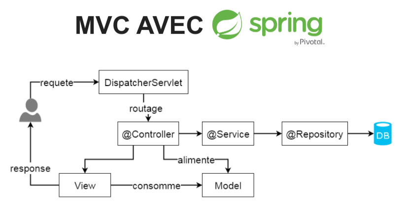

## IFI - TP 5 - GUI - MVC & Templating

### Thi-Ngoc-Anh TRAN, M2-E-Service 2019-2020, Université de Lille

https://juwit.github.io/ifi-2019/cours/05-gui/05-tp-gui.html

#### 1. Configuration de Java 12 sur les postes de l’université
Modifier le fichier ~/.bashrc pour y ajouter les lignes suivantes :

> export JAVA_HOME=/usr/lib/jvm/jdk-12.0.1

> export PATH=$JAVA_HOME/bin:$PATH

### 2. Config url :
Dans config de tomcat : deployement -> application context : mettre /

### 3. Pré-requise : 
- java : version >= 12
- maven : version >= 3

### 4. Heroku TP2 : 

- Essayer les URLs suivants dans un navigateur (chrome, firefox, ...):
    + https://pokemon-type-atr.herokuapp.com/pokemon-types/
    + https://pokemon-type-atr.herokuapp.com/pokemon-types/5
    + https://pokemon-type-atr.herokuapp.com/pokemon-types/?name=mew
    + https://pokemon-type-atr.herokuapp.com/pokemon-types/?types=bug,poison

### 5. Heroku (TP3) :
- Essayer les URLs suivants dans un navigateur (chrome, firefox, ...)
    + https://trainer-api-atr.herokuapp.com/
    + https://trainer-api-atr.herokuapp.com/trainers/
    + https://trainer-api-atr.herokuapp.com/trainers/Ash
    
- Sur terminal, pour tester POST/PUT/DELETE :
    + curl -X POST https://trainer-api-atr.herokuapp.com/trainers/ -H 'Content-type:application/json' -d '{"name": "Bug Catcher","team": [{"pokemonTypeId": 13, "level": 6},{"pokemonTypeId": 10, "level": 6}]}'
    + curl -X PUT https://trainer-api-atr.herokuapp.com/trainers/Bug%20Catcher -H 'Content-type:application/json' -d '{"name": "Bug Catcher","team": [{"pokemonTypeId": 13, "level": 7},{"pokemonTypeId": 10, "level": 8}]}'
    + curl -X DELETE https://trainer-api-atr.herokuapp.com/trainers/Bug%20Catcher

### 6. Execution

- La première vue : http://localhost:9000 